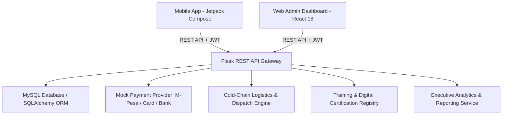

# AAA GROWERS - Enterprise Agricultural E-Commerce & Management System

[](https://python.org)
[](https://flask.palletsprojects.com/)
[](https://react.dev/)
[](https://tailwindcss.com/)
[](https://kotlinlang.org/)
[](https://developer.android.com/jetpack/compose)
[](https://mysql.com)

A full-stack enterprise agricultural management and e-commerce platform designed for **AAA Growers Limited**, Kenya's leading exporter of premium fresh vegetables, cut flowers, and culinary herbs.

---

## 🌟 System Architecture Overview



The system comprises 4 major pillars:
1. **Flask REST API Backend (`backend/`)**: Python 3.11+, Flask 3, SQLAlchemy ORM, JWT authentication, RBAC decorators, automatic inventory deduction, training overbooking prevention, SHA-256 certificate hashing, and sales reporting.
2. **Relational MySQL Database (`database/`)**: 20 normalized tables with primary/foreign keys, cascade behaviors, and indexes.
3. **React Administrator Web Dashboard (`admin_dashboard/`)**: Vite + React 18 + Tailwind CSS + Recharts + Lucide Icons featuring 17 management modules, sales charts, printable invoices, and high-prestige certificate generators.
4. **Android Kotlin Mobile Application (`mobile_app/`)**: Native Kotlin, Jetpack Compose Material 3, MVVM Architecture, StateFlow, Retrofit 2 client with discrete Customer and Outgrower Farmer hubs.

---

## 👥 10 Operational User Roles

| Role | Description | Accessible Modules |
| :--- | :--- | :--- |
| `ADMIN` | Full administrative control across the enterprise | All 17 Dashboard Modules & APIs |
| `CUSTOMER` | Retail and wholesale produce buyers | Mobile App: Catalog, Cart, Checkout, Order Tracking, History, Profile |
| `FARMER` | Contracted outgrower farmers | Mobile App: Farm Profile, Training Sessions, Bookings, Certificates |
| `INVENTORY_MANAGER` | Warehouse and cold storage controllers | Dashboard: Products, Categories, Stock Levels, Adjustments, Logs |
| `FINANCE_MANAGER` | Accounting and revenue managers | Dashboard: Payments, Transactions, Refunds, Sales & Order Reports |
| `SUPPLIER` | Agricultural input vendors (seeds, fertilizers) | Dashboard: Suppliers Directory, Input Catalog |
| `DISPATCH_MANAGER` | Logistics and fulfillment coordinators | Dashboard: Orders, Logistics Dispatch, Driver Fleet Allocation |
| `SERVICE_MANAGER` | Customer care and dispute resolution agents | Dashboard: Customer Directory, Ratings & Reviews, Support Contacts |
| `TRAINER` | Agronomists and training assessors | Dashboard: Training Masterclasses, Farmer Attendance, Certification Issuance |
| `DRIVER` | Cold-chain delivery fleet couriers | Dashboard: Assigned Dispatch Routes, Delivery Status Steppers |

---

## 🗄️ Relational Database Schema (20 Tables)

- **`roles`**: Role definitions (`ADMIN`, `CUSTOMER`, `FARMER`, `INVENTORY_MANAGER`, `FINANCE_MANAGER`, `SUPPLIER`, `DISPATCH_MANAGER`, `SERVICE_MANAGER`, `TRAINER`, `DRIVER`).
- **`users`**: User credentials, contact information, role association, status (`ACTIVE`, `INACTIVE`, `SUSPENDED`).
- **`farmers`**: Outgrower profiles (farm name, location, acreage, crops grown, farming experience, national ID).
- **`trainers`**: Certified agronomists (specialization, bio, certification credentials).
- **`categories`**: Produce taxonomies (slugs, descriptions, banner imagery).
- **`products`**: Horticultural produce items (SKU, category, price, cost, unit, description, stock status, featured flag).
- **`inventory`**: Real-time warehouse stock tracker with low-stock thresholds.
- **`inventory_logs`**: Immutable audit logs of stock movements (`RESTOCK`, `SALE`, `DAMAGE`, `ADJUSTMENT`, `RETURN`).
- **`orders`**: Customer orders with financial totals, workflow status (`PENDING`, `PAID`, `PROCESSING`, `DISPATCHED`, `DELIVERED`, `CANCELLED`), delivery details.
- **`order_items`**: Line items per order (product, quantity, unit price, subtotal).
- **`payments`**: Financial ledger entries (transaction reference, payment method, amount, status).
- **`training_sessions`**: Agronomy masterclasses (trainer, title, category, date, time, location, capacity, status).
- **`training_bookings`**: Farmer course bookings (`BOOKED`, `ATTENDED`, `COMPLETED`, `CANCELLED`).
- **`certifications`**: Issued credentials (certificate number, issue date, SHA-256 verification hash).
- **`suppliers`**: Agricultural input vendors (seeds, organic fertilizers, equipment).
- **`drivers`**: Cold-chain fleet drivers (vehicle registration, vehicle type, availability).
- **`dispatches`**: Logistics dispatch assignments with milestone tracking notes.
- **`feedback`**: Customer and farmer service reviews and star ratings.
- **`contacts`**: Public contact form inquiries and status tracking (`NEW`, `IN_PROGRESS`, `RESOLVED`).
- **`notifications`**: Targeted user alerts and updates.

---

## 🔑 Default Credentials & Role Presets

All pre-seeded test accounts use the password: `Password123!`

- **Administrator**: `admin@aaagrowers.co.ke`
- **Retail Customer**: `customer@aaagrowers.co.ke`
- **Outgrower Farmer**: `farmer@aaagrowers.co.ke`
- **Inventory Manager**: `inventory@aaagrowers.co.ke`
- **Finance Manager**: `finance@aaagrowers.co.ke`
- **Dispatch Manager**: `dispatch@aaagrowers.co.ke`
- **Customer Care**: `service@aaagrowers.co.ke`
- **Lead Agronomist Trainer**: `trainer@aaagrowers.co.ke`
- **Fleet Driver**: `driver@aaagrowers.co.ke`
- **Input Supplier**: `supplier@aaagrowers.co.ke`

---

## 🚀 Quick Start Guide

### 1. Backend REST API Setup

```bash
# Navigate to backend directory
cd backend

# Create and activate virtual environment
python -m venv venv
venv\Scripts\activate  # On Windows

# Install Python requirements
pip install -r requirements.txt

# Seed the database with all 10 roles, products, inventory, sessions & dispatches
python seed.py

# Run automated test suite (16 test cases)
pytest -v

# Start the Flask API Server (Runs on http://localhost:5000)
python run.py
```

### 2. React Admin Web Dashboard Setup

```bash
# Navigate to admin_dashboard directory
cd admin_dashboard

# Install NPM packages
npm install

# Start Vite Development Server (Runs on http://localhost:5173 with proxy to backend)
npm run dev

# Or build production assets
npm run build
```

### 3. Android Mobile Application Setup

1. Open **Android Studio** (Hedgehog 2023.1+ or newer recommended).
2. Select **Open an Existing Project** and browse to `AAA_Growers/mobile_app`.
3. Allow Gradle to sync dependencies (`Jetpack Compose Material 3`, `Retrofit 2`, `Coil`, `Lifecycle`).
4. In `mobile_app/app/src/main/java/com/aaagrowers/app/data/api/ApiClient.kt`, the `BASE_URL` is configured for the Android Emulator (`http://10.0.2.2:5000/api/`).
5. Launch the app on an Android Emulator or physical device connected over USB/Wi-Fi.

---

## 📊 REST API Endpoints Summary

### Authentication (`/api/auth`)
- `POST /api/auth/register` — Register customer or farmer.
- `POST /api/auth/login` — Authenticate and receive JWT token.
- `GET /api/auth/me` — Verify token and get current user profile.
- `PUT /api/auth/profile` — Update personal or farm profile.

### Products & Catalog (`/api/products`)
- `GET /api/products` — Filterable product catalog (category, search, featured, stock).
- `GET /api/products/<id>` — Product details.
- `POST /api/products` — `[Admin/Inventory]` Create produce item.
- `PUT /api/products/<id>` — `[Admin/Inventory]` Update produce item.
- `PATCH /api/products/<id>/toggle-status` — Activate/deactivate produce item.
- `GET /api/categories` — List produce categories.
- `POST /api/categories` — `[Admin/Inventory]` Create produce category.

### Warehouse & Inventory (`/api/inventory`)
- `GET /api/inventory` — Real-time stock levels and threshold alerts.
- `PUT /api/inventory/<product_id>` — Manual stock intake / adjustments with reason logging.
- `GET /api/inventory/logs` — Immutable audit trail of stock movements.

### Orders & Logistics (`/api/orders`, `/api/dispatches`)
- `POST /api/orders` — Create customer order & deduct stock safely.
- `GET /api/orders` — Customer orders or administrative order stream.
- `GET /api/orders/<id>` — Itemized invoice and dispatch details.
- `PUT /api/orders/<id>/status` — Advance order fulfillment lifecycle.
- `POST /api/payments` — Process M-Pesa / Card / Bank mock transaction.
- `POST /api/payments/<id>/refund` — Execute transaction refund.
- `GET /api/dispatches` — Delivery fleet tracker.
- `PUT /api/dispatches/<id>/assign-driver` — Assign driver & vehicle.
- `PUT /api/dispatches/<id>/status` — Update transit milestones.

### Farmer Academy (`/api/trainings`, `/api/certifications`)
- `GET /api/trainings` — Upcoming masterclasses with seat capacity counters.
- `POST /api/trainings` — `[Trainer/Admin]` Schedule agronomy masterclass.
- `POST /api/trainings/<id>/book` — Farmer 1-click seat booking.
- `GET /api/trainings/my-bookings` — Farmer's active and past bookings.
- `POST /api/trainings/bookings/<id>/complete` — `[Trainer]` Mark passed and generate digital certificate with SHA-256 hash.
- `GET /api/certifications` — View digital certificate registry.

### Executive Reports (`/api/reports`)
- `GET /api/reports/dashboard` — Live 8 KPI cards summary.
- `GET /api/reports/sales?period=daily|weekly|monthly|annual` — Revenue analytics.
- `GET /api/reports/orders` — Order volume and status distributions.
- `GET /api/reports/inventory` — Stock valuation and replenishment warnings.
- `GET /api/reports/training` — Outgrower capacity and certification throughput.

---

## 🔒 Security & Best Practices

- **JWT Authentication**: Secure Bearer tokens with role claims.
- **Role-Based Access Control**: Strict `@role_required` decorators protecting staff routes.
- **Stock Guard**: Orders cannot exceed physical warehouse stock quantities; transactions rollback automatically if stock is insufficient.
- **Certificate Verification**: Every certificate carries a unique tamper-evident SHA-256 verification hash derived from farmer, training, and timestamp metadata.
- **Password Security**: Password hashing using industry-standard bcrypt.

---

## 📄 License

Proprietary enterprise software built for **AAA Growers Limited**.
